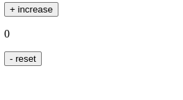

# Latihan Component State dan Event Handling

Di latihan kali ini, kita akan merealisasikan aplikasi counter dengan menuliskan kode secara langsung menggunakan React. Sebelum mulai, ketahuilah tujuan dari latihan yang akan kita lakukan di bawah ini.

- Mengetahui cara menyimpan data di dalam state.
- Mengetahui cara mengubah data di dalam state.
- Memanfaatkan data di dalam state untuk menampilkan UI.
- Mengetahui cara event handling pada component.

Kita akan membangun aplikasi counter dengan improvisasi agar lebih menantang. Kami sebut aplikasi ini dengan nama “FizzBuzz Counter”. Kurang lebih fungsi dan tampilannya tampak seperti ini.

FizzBuzz Counter ini sama seperti counter pada umumnya, tetapi ada sedikit perbedaan yaitu:

- bila angka termasuk kelipatan 5, aplikasi akan menampilkan Fizz,
- bila angka termasuk kelipatan 7, aplikasi akan menampilkan Buzz, dan
- bila angka termasuk kelipatan 5 dan 7, aplikasi akan menampilkan FizzBuzz.

Aplikasi di atas juga terdapat tombol increase untuk menambahkan nilai dan reset untuk mengatur ulang nilai.
